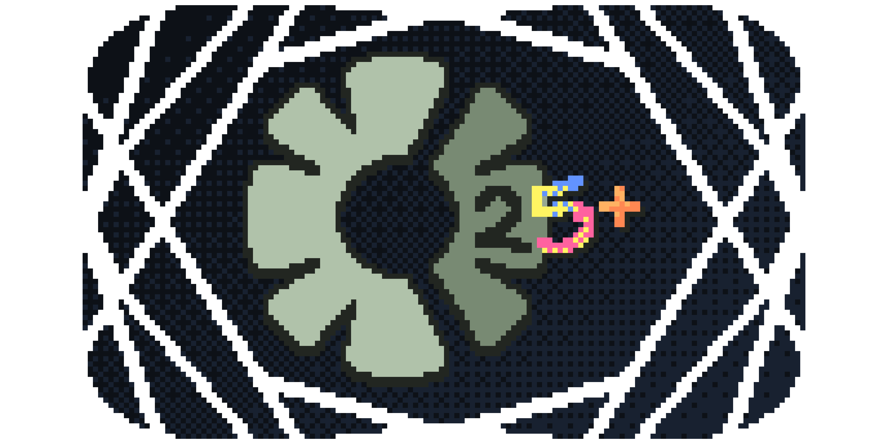

# Fresh NW for Construct 2 (Formerly Neo NW)
My own modern replacement for "NW.js for Construct 2", made to last far beyond 2025.

> [!NOTE]
> - Due to how Construct 2 handles NW.js support, files need to be placed in a specific directory: `C:\Program Files\NWjsForC2`. This is why it is a requirement that you use an elevated terminal or else this may not function as intended, or at all.
>
> - Downloads may be slower than desired due to the single-threaded nature of Node.js. I'm actively figuring out how to get multi-threaded downloads functioning, though I'm not very knowledgable and the solution might be messy, so if you know how to get this working, please feel free to create a pull-request!

## Usage

- Make sure you have [Node.js](https://nodejs.org) and [pnpm](https://pnpm.io) installed.

- Clone this repository and open it's directory into an elevated terminal.

- Run `pnpm i` and then either `pnpm start` or `pnpm construct` and let it do it's thing.

- If you want to prevent deleting the `temp` directory after installing, or choose a specific version of NW.js to install, you can edit the `config.json` file in the `src` directory.

- Once Fresh NW says it's done installing, you should be able to export your Construct 2 games with a much more stable version of NW.js! (Or less stable, if you're into that.)
      
## Troubleshooting

- Make sure you don't have the official NW.js support for Construct 2. If you do have it installed, uninstall it as you would any other Windows program. Theoretically, you should also be able to uninstall it using `pnpm deconstruct`, though it's not recommended.

- If Construct 2 is telling you NW.js support is not installed, or Fresh NW isn't recognising any new NW.js hotfix, you can force an install without checking for updates by running either `pnpm start:force` or `pnpm construct:force`.

- You can reinstalling by running `pnpm reconstruct`. This uninstalls everything, then attempts an install from scratch.

- If all else fails, you can uninstall everything by running `pnpm deconstruct`.

> [!WARNING]
>
> If you are STILL having issues, you should make sure you have a capable system/os and make sure you have a newer version of Node.js installed. This was originally created with Node v18 and tested with Node v22. If you're having issues with a Node version that isn't on Long-Term Support and older than 18.20.8, you will not receive support.
>
> **If all else fails, consider investing in a new system!**
>

----

<i>The Neo NW icon uses the Construct 2 logo, <a href="https://www.roblox.com/catalog/122415713240099/Sonic-Ova-Movie-Iconic-Pink-Hat">this Roblox hat</a>, and <a href="https://www.homedepot.com/p/Brazos-Walking-Sticks-37-in-Twisted-Walnut-Walking-Cane-502-3000-0281/205856200">this cane from the Home Depot website</a>.</i>       
<i>Not affiliated with Scirra Ltd.</i>