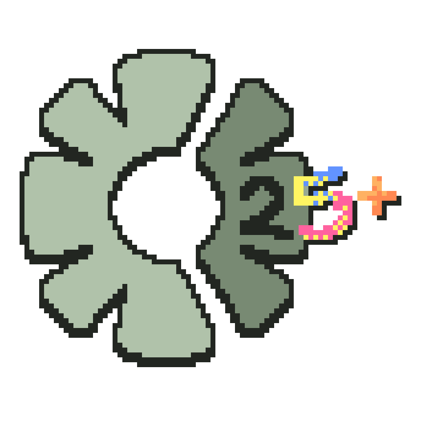

# Fresh NW for Construct 2 (Formerly Neo NW)
My own modern replacement for "NW.js for Construct 2", made to last far beyond 2025.

> [!NOTE]
> - Due to how Construct 2 handles NW.js support, files need to be in a specific directory: `C:\Program Files\NWjsForC2`. This is why it is required you use an elevated terminal to run this, or else it may not function as intended.
>
> - Downloads may be slower than desired due to the single-threaded nature of Node.js. I'm actively figuring out how to get multi-threaded downloads functioning, though I'm not very knowledgable and the solution might be messy, so if you know how to get this working, please feel free to create a pull-request!

## Usage

- Make sure you have [Node.js](https://nodejs.org) and [pnpm](https://pnpm.io) installed.

- Clone this repository and open it's directory into an elevated terminal.

- Run `pnpm i` and then either `pnpm start` or `pnpm construct` and let it do it's thing.

- Once Fresh NW says it's done installing, you should be able to export your Construct 2 games with the latest and greatest of NW.js!
      
## Troubleshooting

If Construct 2 is telling you NW.js support is not installed, or Fresh NW isn't recognising any new NWjs hotfix, you can skip the update check and force an install by running either `pnpm start:force` or `pnpm construct:force`.

To uninstall, run `pnpm deconstruct`.

----

<i>Neo NW icon uses the Construct 2 logo, <a href="https://www.roblox.com/catalog/122415713240099/Sonic-Ova-Movie-Iconic-Pink-Hat">this Roblox hat</a>, and <a href="https://www.homedepot.com/p/Brazos-Walking-Sticks-37-in-Twisted-Walnut-Walking-Cane-502-3000-0281/205856200">this cane from the Home Depot website</a>.</i>       
<i>Not affiliated with Scirra Ltd.</i>